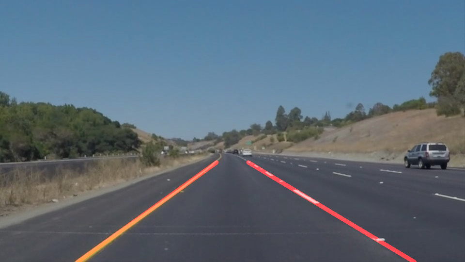
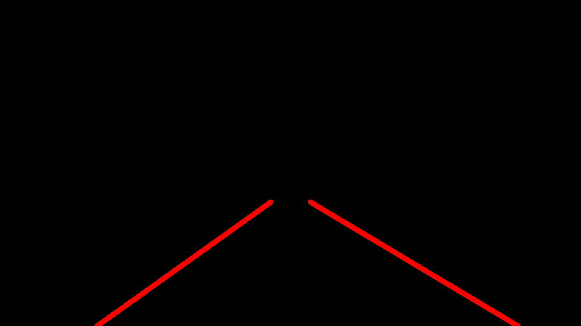

# **Finding Lane Lines on the Road**
[](http://www.udacity.com/drive)



Overview
---

When we drive, we use our eyes to decide where to go.  The lines on the road that show us where the lanes are act as our constant reference for where to steer the vehicle.  Naturally, one of the first things we would like to do in developing a self-driving car is to automatically detect lane lines using an algorithm.

In this project you will detect lane lines in images using Python and OpenCV.  OpenCV means "Open-Source Computer Vision", which is a package that has many useful tools for analyzing images.  

---

The goals / steps of this project are the following:
* Make a pipeline that finds lane lines on the road
* Reflect on your work in a written report

---

## Reflection

### 1. Describe your pipeline. As part of the description, explain how you modified the draw_lines() function.

#### Pipeline details
##### 1) Read image then select Yellow and White colors
```
img = mpimg.imread('test_images/solidWhiteCurve.jpg')

# Select Yellow Line in HSV
hsv_img = cv2.cvtColor(img, cv2.COLOR_RGB2HSV)
yellow_hsv_low = np.array([0, 80, 200], np.uint8)
yellow_hsv_high = np.array([40, 255, 255], np.uint8)
yellow_mask = cv2.inRange(hsv_img, yellow_hsv_low, yellow_hsv_high)
```

Yellow selected:


```
# Select White Line in RGB
white_rgb_low = np.array([200, 200, 200], np.uint8)
white_rgb_high = np.array([255, 255, 255], np.uint8)
white_mask = cv2.inRange(img, white_rgb_low, white_rgb_high)
```

White selected:


```
# Select Yellow and White
yellow_white_mask = cv2.bitwise_or(yellow_mask, white_mask)
color_selected = cv2.bitwise_and(img, img, mask=yellow_white_mask)
```

Merged (Yellow + White):


##### 2) Convert to grayscale and apply Gaussian blur to reduce noise
```
gray = cv2.cvtColor(color_selected, cv2.COLOR_RGB2GRAY)
kernel_size = 5
blur_gray = cv2.GaussianBlur(gray, (kernel_size, kernel_size), 0)
```


##### 3) Run Canny Edge Detection on blurred gray image
```
low_threshold = 50
high_threshold = 150
canny_edges = cv2.Canny(blur_gray, low_threshold, high_threshold)
```


##### 4) Define Region of Interest (ROI) with four sided polygon then crop image

ROI related variables:
```
roi_top_left_x_ratio     = 0.42  # Top left_X of Region of Interest: width * roi_top_left_x_ratio
roi_top_right_x_ratio    = 0.58  # Top right_X of Region of Interest: width * roi_top_right_x_ratio
roi_top_y_ratio          = 0.62  # Top Y of Region of interest: height * roi_top_y_ratio
```

The vertices of ROI are calculated with image size and variables defined above.
```
imshape = image.shape
top_y = int(imshape[0] * roi_top_y_ratio)
top_left_x = int(image.shape[1] * roi_top_left_x_ratio)
top_right_x = int(image.shape[1] * roi_top_right_x_ratio)
vertices = np.array([[(0, imshape[0]), (top_left_x, top_y),
                      (top_right_x, top_y), (imshape[1], imshape[0])]], dtype=np.int32)

masked_edges = region_of_interest(canny_edges, vertices)
```


##### 5) Run HoughLinesP to find line segments on masked, edge detected image using the probabilistic Hough transform
```
rho = 2            # distance resolution in pixels of the Hough grid
theta = np.pi/180  # angular resolution in radians of the Hough grid
threshold = 30     # minimum number of votes (intersections in Hough grid cell)
min_line_len = 5  # minimum number of pixels making up a line
max_line_gap = 10  # maximum gap in pixels between connectable line segments
lines_image = hough_lines(masked_edges, rho, theta, threshold, min_line_len, max_line_gap)
```



##### 6) Draw lines on original image
```
α = 0.8, β = 1.0, λ = 0.0
result = cv2.addWeighted(image, α, lines_image, β, λ)
```


#### Changes on draw_lines()
The followings have been done on draw_lines() function to draw a single line on the left and right lanes:
* Separate left and right line segments using slopes, filter out horizontal lines (slope < slope_threshold)
* Filter out unexpected line segments whose slopes and locations don't match (e.g., slope < 0 but located in the right half of image)
* Run polyfit on valid line segments to calculate slope and bias for both lines
* To avoid jumpy when test on videos, apply the slopes and bias from previous frame with the result calculated above, to generate the final slope / bias we will use
* Extend lane boundaries accordingly

### 2. Identify potential shortcomings with your current pipeline
* The parameters used in Canny edge detection and Hough Transform are manually tuned and hardcoded. It works well with the sample images and videos, while it may fail at different weather and light conditions (rain, snow or at night)
* The pipeline relies on region of interest (ROI) to reduce noises, while the tuned parameters may not work when camera installation changes

### 3. Suggest possible improvements to your pipeline
* Design algorithms to dynamically update parameters of ROI, edge detection and Hough Transform
