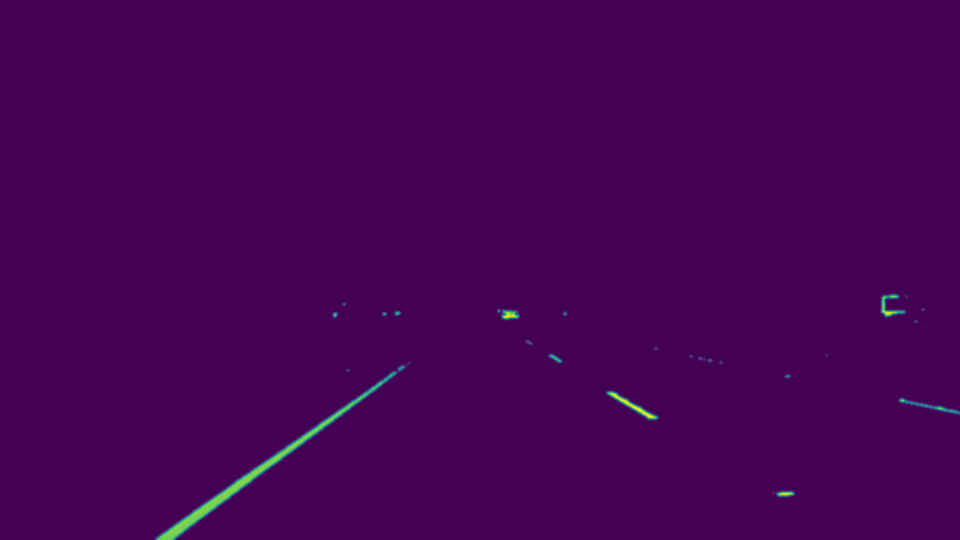
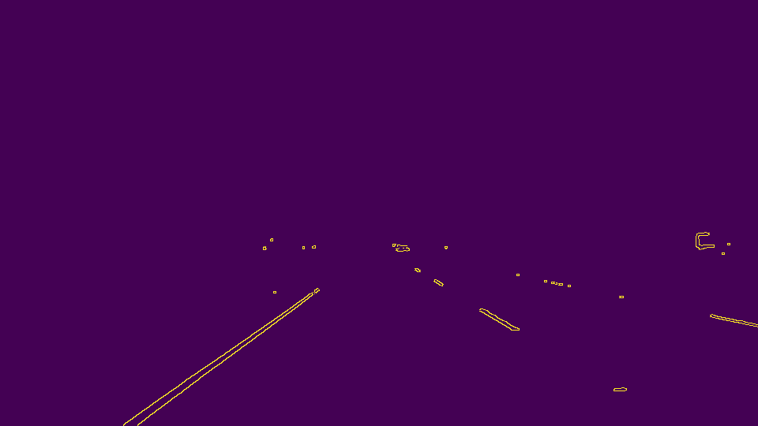

# **Finding Lane Lines on the Road**

---

The goals / steps of this project are the following:
* Make a pipeline that finds lane lines on the road
* Reflect on your work in a written report

[//]: # (Image References)

[Gray Image]: ./test_images_output/pipeline/gray.jpg "Grayscale"

---

## Reflection

### 1. Describe your pipeline. As part of the description, explain how you modified the draw_lines() function.

#### Pipeline details
1) Read image and convert to grayscale
```
image = mpimg.imread('test_images/solidWhiteCurve.jpg')
gray = cv2.cvtColor(img, cv2.COLOR_RGB2GRAY)
```


2) Apply Gaussian blur with kernel size 5*5 to reduce noise
```
kernel_size = 5
blur_gray = cv2.GaussianBlur(gray, (kernel_size, kernel_size), 0)
```


3) Run Canny Edge Detection on blurred gray image
```
low_threshold = 50
high_threshold = 150
canny_edges = cv2.Canny(blur_gray, low_threshold, high_threshold)
```


4) Define the region of interest with four sided polygon then create a masked image

Global variables are defined to allow customization for different scenarios.
```
roi_top_left_x_ratio     = 0.40  # Top left_X of Region of Interest: width * roi_top_left_x_ratio
roi_top_right_x_ratio    = 0.60  # Top right_X of Region of Interest: width * roi_top_right_x_ratio
roi_top_y_ratio          = 0.65  # Top Y of Region of interest: height * roi_top_y_ratio
roi_bottom_left_x_ratio  = 0.10  # Bottom left_X of Region of Interest: width * roi_bottom_left_x_ratio
```

The vertices of region of interest are calculated with image size and variables defined above.
```
imshape = image.shape
top_y = int(imshape[0] * roi_top_y_ratio)
top_left_x = int(image.shape[1] * roi_top_left_x_ratio)
top_right_x = int(image.shape[1] * roi_top_right_x_ratio)
bottom_left_x = int(image.shape[1] * roi_bottom_left_x_ratio)
vertices = np.array([[(bottom_left_x, imshape[0]), (top_left_x, top_y),
                      (top_right_x, top_y), (imshape[1] - 50, imshape[0])]], dtype=np.int32)
masked_edges = region_of_interest(canny_edges, vertices)
```


5) Run HoughLinesP to find line segments on masked, edge detected image using the probabilistic Hough transform
```
rho = 2            # distance resolution in pixels of the Hough grid
theta = np.pi/180  # angular resolution in radians of the Hough grid
threshold = 20     # minimum number of votes (intersections in Hough grid cell)
min_line_len = 30  # minimum number of pixels making up a line
max_line_gap = 20  # maximum gap in pixels between connectable line segments
lines_image = hough_lines(masked_edges, rho, theta, threshold, min_line_len, max_line_gap)
```


6) Draw lines on initial image
```
α = 0.8, β = 1.0, λ = 0.0
result = cv2.addWeighted(image, α, lines_image, β, λ)
```


#### Changes on draw_lines()
The followings have been done on draw_lines() function to draw a single line on the left and right lanes:
* Separate left and right line segments using slopes, filter out horizontal lines (slope < slope_threshold)
* Filter out unexpected line segments whose slopes and locations don't match (e.g., slope < 0 but located in the right half of image)
* Run polyfit on the remaining line segments to get slope and bias of lane lines
* To avoid lines being jumpy when test on videos, combine the knowledge from previous frame with the result fitted above to calculate the final slope and bias, then extend the left and right lane boundaries accordingly

### 2. Identify potential shortcomings with your current pipeline

* Lane detection doesn't work well with optional challenge since the noise caused by tree shadows and pavement color changes are not well handled
* The parameters used in Canny edge detection and Hough Transform are manually tuned and hardcoded. It works with the  sample images and videos, while it will easily fail at different weather and light conditions (rain, snow or at night)
* The pipeline uses region of interest (ROI) to reduce noises, while the tuned ROI parameters may not work when camera installation changes

### 3. Suggest possible improvements to your pipeline
* Design an algorithm to dynamically update parameters of ROI, edge detection and Hough Transform
* Apply color selection to reduce the noises caused by different weather and light conditions
